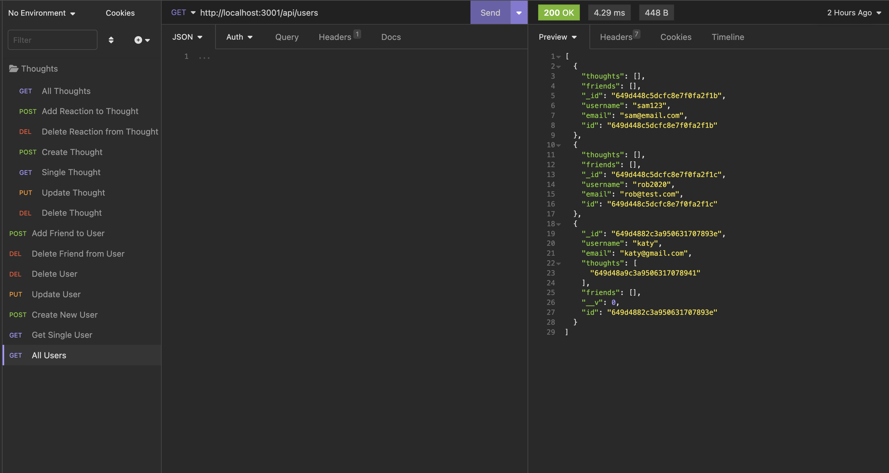

# socialise

An API for a social network web application where users can share their thoughts, react to friends’ thoughts, and create a friend list.

## User Story

```md
AS A social media startup
I WANT an API for my social network that uses a NoSQL database
SO THAT my website can handle large amounts of unstructured data
```

## Acceptance Criteria

```md
GIVEN a social network API
WHEN I enter the command to invoke the application
THEN my server is started and the Mongoose models are synced to the MongoDB database
WHEN I open API GET routes in Insomnia for users and thoughts
THEN the data for each of these routes is displayed in a formatted JSON
WHEN I test API POST, PUT, and DELETE routes in Insomnia
THEN I am able to successfully create, update, and delete users and thoughts in my database
WHEN I test API POST and DELETE routes in Insomnia
THEN I am able to successfully create and delete reactions to thoughts and add and remove friends to a user’s friend list
```

## Mock-Up

The following screenshots demonstrate the application functionality:




## Walkthrough Video

The walkthrough video showing the data output in Insomnia is given below:
[walkthrough video](https://drive.google.com/file/d/1vg7Hw7p_G1ezSy_tRPU1vBKGP3TrGM7-/view?usp=sharing)

The demonstration to show the functionality where all associated thoughts are deleted when user is deleted is given below:
[bonus](https://drive.google.com/file/d/1M-_bdgFTRWVhmQ_BXnSlQE7MZ-HMcsyA/view?usp=sharing)

## Technologies used

- Express.JS
- MongoDB
- Mongoose
- Insomnia

## Usage

- Clone the repo, navigate to the root folder, run the following commands from the CLI:

```md
node utils/seed
node server.js
```
